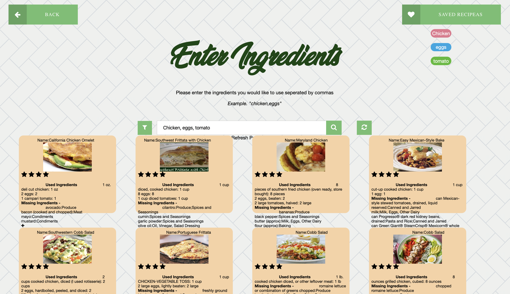

## Goal

- Our cooking application mainly targets those that are young professionals between the ages of 20-30. We plan to optimize our application for those that have busy schedules (limited time to cook) and may not know how to cook or may struggle to find recipes for the ingredients they have on-hand.
- There are many webApps that help users to search of recipes with key ingredients. But it doesn't account for all the other ingredients that user might not have to prepare the dish. Help people by providing instructions or recipes to cook food based on the ingredients they have in the kitchen. 
- Our goal is to provide a WebApp for easy recipe search based on ingredients.
## User Research 
- The research we conducted aimed towards understanding our user habits and preferences. Our users were assumed to be young students and professionals who don’t have many ingredients at home, don’t have time to buy many groceries, and most often don’t know how to cook. While all these observations are true. Conducting these interviews helps us understand the additional requirements of the users. 
- We chose to take interviews with potential users of this application. We asked them questions on their lifestyle, cooking habits, and their preferences.
- The initial proposal was to build an app that makes recipe suggestions based on ingredients. After the interviews and evaluating Personas & Scenarios the need to make sure that these recipes are quick to prepare also arises. Users who prefer this app are extremely busy and what they prefer is recipe suggestions that make use of few ingredients, quick & easy to prepare and multiple recipe options for the same set of ingredients with dietary restrictions in mind.

## Paper Prototype

After user testing, most users liked the simple button options and the filter search. A lot of users didn't know that fliping the ingredients will give a list of ingredients. Based on some suggestion, we wanted to populate the recipies after user has entered the requirements in the high-fidelity protoype.

## High-Fidelity Prototype  

### Tasks:

#### 1. Filter, Search, & Refresh 

#### 2. Add Search by Recipea Name

#### 3. Save Recipes 

### Components:

#### 1. Branding  

The addition of Brand-components relates to the points made in Norman’s interface design principles. For one, our design principles are analogous to the narrative explained in the text surrounding holds on telephones. The new telephone in Norman’s example had many new features that users didn’t care about, but agreed that one small feature (the hold button) was missing. People seem to intuitively know how they want their tools to work. Our goal through Brand development, element building, and revisioning is to make our application feel natural and simple to the user while still providing rich cuisine assistance to the user.  

Our new prototype version aligns more closely to several of the graphic design principles covered in class. Our core focus was very much around color and composition. These two factors really help drive our project identity/values so that the user has a more intuitive experience using our tool. We decided to go with medium-saturation, ‘Earthy’ color palette made up of many secondary colors. The purpose was to have somewhat of a combination between tertiary and complementary color combinations.  

#### 2. Interactive Data Filter

#### 3. External Data Integration

#### 4. Gamification

## Reflection
- Throughout the course, we were able to develop a cooking website that provides users with the knowledge to cook meals with varying degrees of experience. Throughout the studio sessions, we were able to integrate critical feedbacks into the design and mechanics of the site to make going through our tasks as easy and efficient as possible.  
- If given more time, we would design profiles so that each user can personalize their own experience, conduct more user testing to improve on the current state of our web application, and encode better accessibility to make the application more accessible to all users.  

## Links
- Link to the Repository [R-e-c-i-p-e-a](https://github.com/R-e-c-i-p-e-a). 
- A link to a working version of the prototype    
- Open the above link on Google Chrome to view the WebApp. 

